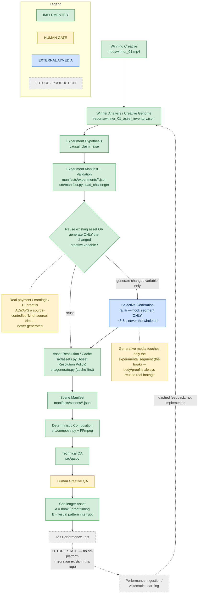
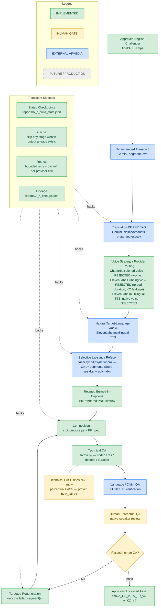

# Almedia Creative Factory — Workflow Sketch

Three diagrams for transfer into Miro/slides: the creative-experimentation
loop, the localization factory, and prototype-vs-production architecture.
Every node is labeled against what this repo actually contains today
(`src/*.py`, `run.py`, `manifests/`, `state/`, `reports/`) — nothing here
claims capability that doesn't exist. Future/production-only stages are
drawn dashed and labeled FUTURE.

Legend used in all three diagrams:

| Style | Meaning |
|---|---|
| 🟩 solid green | IMPLEMENTED — real code/data in this repo |
| 🟨 solid amber | HUMAN GATE — a human decision point, not automated |
| 🟦 solid blue | EXTERNAL AI/MEDIA — a paid third-party provider call |
| ⬜ dashed grey | FUTURE / PRODUCTION — not implemented |

---

## Diagram 1 — Creative Experimentation Loop

**Evidence from the actual prototype:**
- Challenger A (`hook_proof_timing`) was built **100% from source reuse** — `reports/winner_01_asset_inventory.json` found the hook fully satisfiable from existing footage, so `src/generate.py` was never invoked; Challenger B (`visual_pattern_interrupt`) generated **only a ~3.16s hook** via fal.ai (`alibaba/happy-horse/text-to-video`) and cut directly into real `winner_01.mp4` footage from the earnings-proof beat onward (`manifests/scenes/challenger_B_v2.json`).
- Every real payment/earnings/UI proof segment in both challengers is a `kind: "source"` trim of `input/winner_01.mp4` — never a generated segment.
- `src/generate.py::request_generated_segment()` raises `GenerationDisabled` rather than fabricating an asset when nothing is cached and no paid call is authorized — verified live against a synthetic no-cache manifest (clean exit 3, no output file created).
- `src/manifest.py`'s validators reject invalid JSON and malformed schema **before** any generation or render runs — verified against both a JSON-syntax break and a schema break (this is the exact failure class that broke Challenger B's manifest by hand-edit during the original build).
- No A/B performance-test integration exists anywhere in this repo; every experiment manifest records `causal_claim: false` — the "A/B Performance Test" and "Performance Ingestion" stages are drawn as FUTURE STATE, not implemented.

---

## Diagram 2 — Localization Factory

**Evidence from the actual prototype:**
- **A_DE v1** (Chatterbox cloned-voice TTS) **passed technical QA but was rejected by human perceptual QA** — "too fast, not sufficiently native-sounding" once the ElevenLabs alternative was heard. This is the project's clearest technical-PASS-vs-perceptual-fail case, and the reason `NOTE3` sits directly on the technical-QA→language-QA edge.
- Voice strategy was **evaluated, not assumed**: ElevenLabs Dubbing v2 (voice-preserving) was tested and rejected for forcing output duration to source length and, for Korean specifically, for producing confirmed English/nonsense leakage; the project moved to ElevenLabs standard multilingual TTS with native target-language voices, **deliberately abandoning source-voice-identity preservation** per human QA — not every final locale preserves the original creator's voice.
- **A_FR targeted repair**: v1 (Chatterbox) → v2 (rejected: too fast) → natural-voice test (approved) → v3 (partial fail: tail English-audio leakage + one malformed segment) → **v4 regenerated only segment 6 and the tail — the other 22 segments and all 5 lip-sync outputs were reused byte-identical**, verified via audio checksum.
- **A_KO targeted repair**: v3 → v4 was a **caption-only fix** (Korean glyphs rendering as tofu boxes in v3); the underlying audio track was verified byte-identical to v3 — no TTS or lip-sync was regenerated.
- Lip-sync was applied **selectively**, only to the segments where the speaker is visibly talking on-screen (derived from `reports/A_EN_speaker_visual_analysis.json`), not to the whole video — the same 5 segment IDs across DE/FR/KO.

---

## Diagram 3 — Prototype vs Production Architecture

```mermaid
flowchart LR
  classDef implemented fill:#d4edda,stroke:#28a745,color:#14532d;
  classDef humangate fill:#fff3cd,stroke:#d39e00,color:#664d03;
  classDef external fill:#cfe2ff,stroke:#0d6efd,color:#052c65;
  classDef future fill:#eeeeee,stroke:#888888,stroke-dasharray: 4 3,color:#555555;
  classDef devenv fill:#f5e6ff,stroke:#8a2be2,color:#3d1361,stroke-dasharray: 2 2;

  subgraph LEGEND["Legend"]
    direction LR
    L1["IMPLEMENTED"]:::implemented
    L2["HUMAN GATE"]:::humangate
    L3["EXTERNAL AI/MEDIA"]:::external
    L4["FUTURE / PRODUCTION"]:::future
  end

  CC["Claude Code<br/>development environment<br/>(NOT part of runtime execution)"]:::devenv

  subgraph PROTO["IMPLEMENTED PROTOTYPE"]
    direction TB
    CLI["CLI / Manifest<br/>run.py validate / compose / qa"]:::implemented
    PCF["Python Creative Factory<br/>src/*.py"]:::implemented
    AIP["Specialized AI/Media Providers<br/>Gemini · fal.ai · ElevenLabs"]:::external
    FF["FFmpeg / ffprobe"]:::implemented
    QAP["QA<br/>src/qa.py"]:::implemented
    FS["Filesystem State / Cache / Lineage<br/>state/*.json, reports/*.json"]:::implemented
    CLI --> PCF --> AIP --> FF --> QAP --> FS
  end

  CC -.->|"accelerated building/hardening this,<br/>runs standalone via plain python3"| CLI

  subgraph PROD["PRODUCTION EVOLUTION — NOT IMPLEMENTED"]
    direction TB
    WEB["Web App / Trigger"]:::future
    ORCH["[n8n] / Durable Orchestration"]:::future
    QW["Queue / Workers"]:::future
    AIP2["AI/Media Providers"]:::future
    OS["Object Storage"]:::future
    RQA["Render / QA"]:::future
    PUB["Publishing / Ad Platform"]:::future
    PIF["Performance Ingestion"]:::future
    FB["Feedback into Creative Intelligence"]:::future
    WEB -.-> ORCH -.-> QW -.-> AIP2 -.-> OS -.-> RQA -.-> PUB -.-> PIF -.-> FB
    FB -.->|"dashed feedback loop"| ORCH
  end

  subgraph CP["Production Control Plane — NOT IMPLEMENTED"]
    direction LR
    OBS["Observability"]:::future
    RET["Retries"]:::future
    IDEM["Idempotency"]:::future
    COST["Cost Tracking"]:::future
    ROUTE["Provider Routing"]:::future
  end

  CP -.-> ORCH
  CP -.-> QW
  CP -.-> AIP2
  CP -.-> RQA

  FS -.->|"production evolution"| WEB
```

**Evidence from the actual prototype:**
- The smoke-test run (`manifests/scenes/challenger_B_v2.json` via `python3 run.py compose ... --out state/smoke/B_EN_v2_smoke.mp4`) resolved the generated hook from the existing cached asset (`assets/generated/challenger_B_v2/hook_gen_v2.mp4`) with **`paid_calls_made=0`**, and left `final/B_EN_v2.mp4` byte-identical before/after (md5-verified).
- Challenger B v1 (face-forward reaction shot) **passed all technical QA but was rejected on human creative review** over an actor-identity mismatch with the real source footage.
- Challenger B v2 (POV bill-drop hook) was **frozen as "acceptable for experimental deployment; incremental creative value uncertain; requires performance validation"** — explicitly not declared a winner.
- The entire runtime (`run.py` + `src/*.py`) executes standalone via plain `python3` invocations with no Claude Code process in the loop — Claude Code appears in this diagram only as the development environment that built and hardened it, positioned outside `PROTO`.
- No object storage, queue, durable orchestrator, web trigger, or ad-platform integration exists in this repo — the entire right-hand production architecture and control plane are drawn FUTURE because none of it has been built.

---

## Architecture principle

> **AI proposes creative hypotheses; deterministic automation executes them; human and performance feedback decide what survives.**
